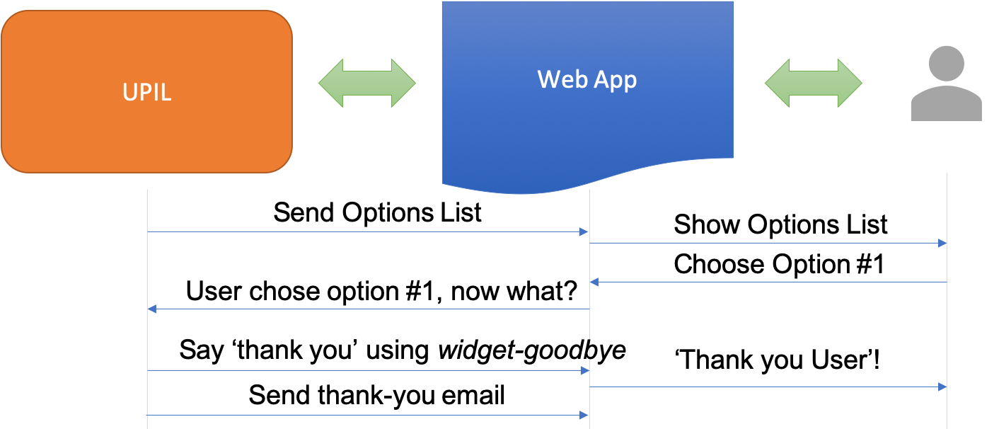
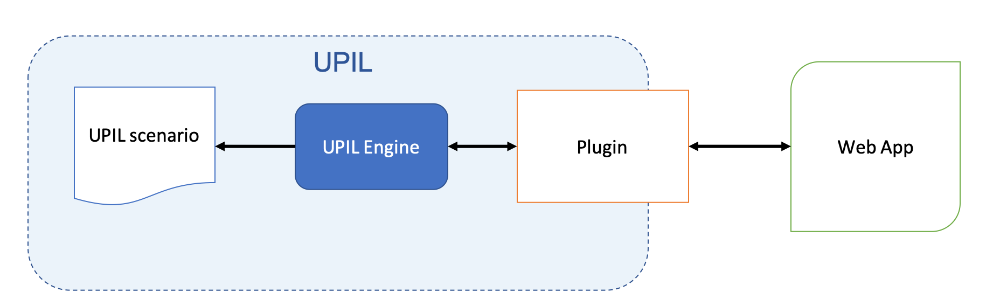

# Introduction to UPIL
UPIL (pronounced you-pill「ユーピル」) is a language and framework designed to make writing applications with lots of interaction with a user - especially chatbots - as easy as possible. It does this by providing a high-level language that is simple enough for non-developers to use. The UPIL language is used to write interaction-scenarios. These are parsed by the UPIL framework, and in turn become events and state used to help manage an application's interaction with its users.

<br><br>

<br><br>

A UPIL scenario describes interaction with a user. It allows you give the user information, collect information as text or options, and use information from a user or external data source to dynamically adjust the scenario, or for personalizing the user-interaction. Here is a list of potential applications where UPIL could improve the development experience:
<br><br>
* Chat bots
* Onboarding flows & App tutorials
* Setup wizards
* Questionnaires & Surveys
* Lessons & Quizzes
* Fulfillment scenarios
* Web forms

## Concrete example

Below is an example UPIL scenario. It will greet a user, ask for their name, and then greet them using that name:

<UpilBot>
```
DIALOG mainDialog
  TEMPLATE "Hi there!"
  TEMPLATE
    "What's your name?"
    >>name
  /TEMPLATE
  TEMPLATE "Nice to meet you ${name}"
/DIALOG
RUN mainDialog
```
</UpilBot>

## What problems does UPIL solve?
UPIL is designed to simplify complex user-interaction scenarios. The kinds of interaction where user inputs dynamically affect later interactions. And where complex branching or recursive interaction-flows take place.
<br><br>
By seperating user-interaction into its own high-level language and plugins, we gain several advantages:

### Improved project collaboration
A UPIL scenario is easy to read and understand. And the simulator tool allows for simplified testing outside of the context of an app. This means that non-developer stakeholders can directly contribute to app development. It means that for updating text and business logic, waiting for a developer to do it for them is no longer a bottleneck.

### Reduce code complexity
By using UPIL in a project, we can eliminate code related to tracking user-interaction state. UPIL also improves the seperations of concerns of code, by encouraging more logical grouping of related tasks such as component-selection, interaction-event handling, user-input handling, and input-validation. Together, this means less chance of errors occuring, and a more logical, maintainable code base. 

### Improved understanding
Extracting business logic into a single scenario makes the entire interaction easier to read and understand. Without UPIL, these interactions are generally written as coded business logic across multiple separate components.

### Isolated development
By using the UPIL simulator and diagram-builder, scenarios are developed separately from their applications. This increases the speed of development, and simplifies debugging of issues.

### Quick implementation
By utilizing UPIL plugins and themes, it's quick to get an application up and running. UPIL plugins ship with default components that work out of the box, but which can be overridden based on a variety of factors. 

## Why use UPIL?

By using UPIL, application development gains two large benefits:

* Extracting high-level user interaction logic into an easy to read scripting language makes the application easier to understand and maintain.
* Non-developers can directly contribute to the development of an application by updating text and the simplified logic directly, rather than wait for a developer to have to perform the task on their behalf. This allows more work to be done in parallel, and requires less maintenance overhead by developers after an application is launched. 

## Usage

 UPIL is composed of three main components:

 

 * **UPIL Language**: The language is used to describe scenarios, which describe high-level business logic. A scenario is a workflow consisting of user↔application interactions.
 * **UPIL Engine**: The engine interprets scenarios, and turns them into concrete nodes, events, and state that an application can use to visualize and respond to.
 * **UPIL Plugins**: Plugins wrap the engine in an API that is easy for developers to work with. Currently there are UPIL plugins for both Vue and React.
