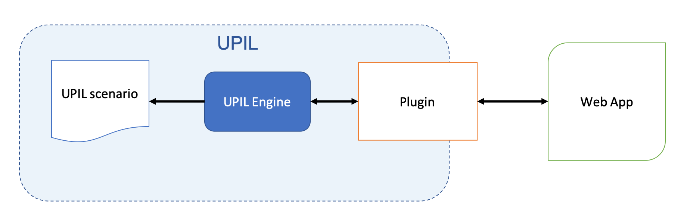

# Introduction to UPIL
UPIL is a language and framework designed to make writing applications with lots of interaction with a user - especially chatbots - as easy as possible. It does this by providing a high-level language that even non-developers can easily contribute to. This language is then used to automate an underlying application.

A UPIL scenario describes a set of steps that an application will move through. It allows you to ask the user for information, and then use that information later to decide which step to take, or for personalizing the user-interaction. Here is a list of potential applications where UPIL could improve the development experience:

* Chat bots
* Onboarding flows
* Setup wizards
* Questionnaires
* Lessons/Quizzes
* Fulfillment scenarios

## Concrete example

Below is an example UPIL scenario. It will greet a user, ask for their name, and then greet them using that name:

<UpilBot>
```
DIALOG mainDialog
  TEMPLATE
    "Hi there!"
  /TEMPLATE
  TEMPLATE
    "What's your name?"
    >>name
  /TEMPLATE
  TEMPLATE
    "Nice to meet you ${name}"
  /TEMPLATE
/DIALOG
RUN main
  mainDialog
/RUN
```
</UpilBot>

## Why use UPIL?

By using UPIL, application development gains two large benefits:

* Extracting high-level user interaction logic into an easy to read scripting language makes the application easier to understand and maintain.
* Non-developers can directly contribute to the development of an application by updating text and the simplified logic directly, rather than wait for a developer to have to perform the task on their behalf. This allows more work to be done in parallel, and requires less maintenance overhead by developers after an application is launched. 

## Usage

 UPIL is composed of three main components:

 

 * **UPIL Language**: The language is used to describe scenarios, which describe high-level business logic. A scenario is a workflow consisting of user↔application interactions.
 * **UPIL Engine**: The engine interprets scenarios, and turns them into concrete nodes, events, and state that an application can use to visualize and respond to.
 * **UPIL Plugins**: Plugins wrap the engine in an API that is easy for developers to work with. Currently there are UPIL plugins for both Vue and React.
