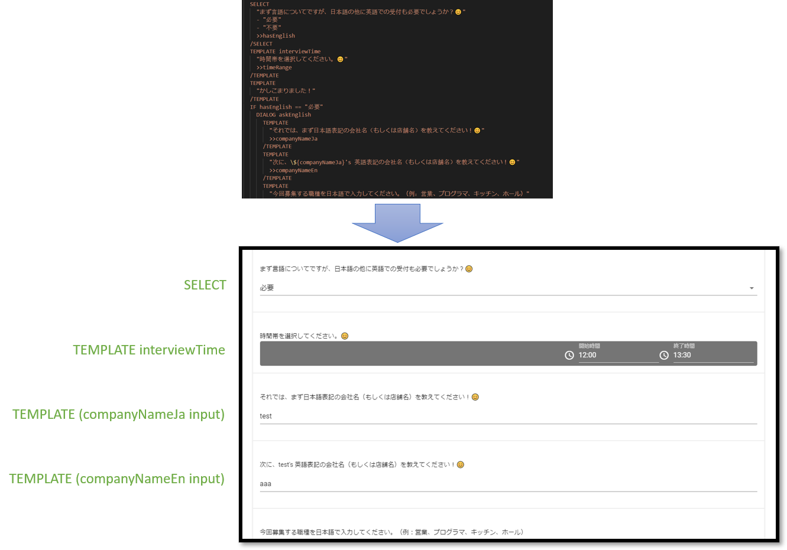
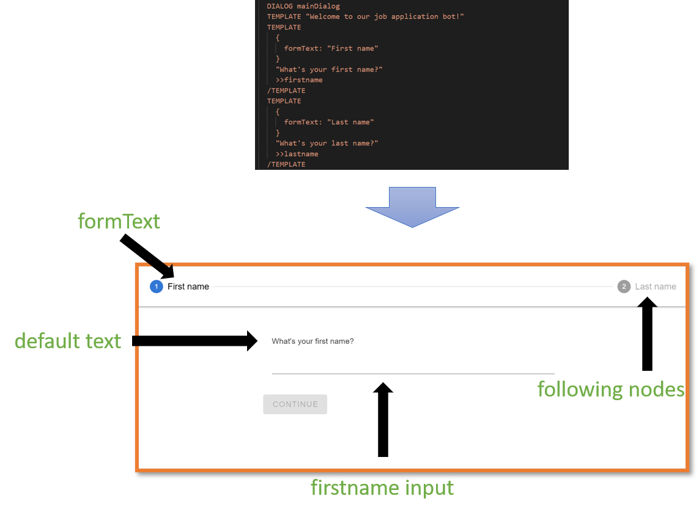

# Vue Application development

## Starter projects

- See a `ChatMode` starter project here: [https://codesandbox.io/s/vue-upil-chat-mode-example-t4zxp](https://codesandbox.io/s/vue-upil-chat-mode-example-t4zxp)
- See a `FormMode` starter project here: [https://codesandbox.io/s/vue-upil-form-mode-example-lkf2c](https://codesandbox.io/s/vue-upil-form-mode-example-lkf2c)
- See a `WizardMode` starter project here: [https://codesandbox.io/s/vue-upil-wizard-mode-example-j3qfs](https://codesandbox.io/s/vue-upil-wizard-mode-example-j3qfs)

## Introduction

Generally, a Vue application developer will setup an instance of `UPILCore`, and then pass that instance to a component which will translate an array of `VisualNode` `nodes[]` into visual elements, and handle user input.
<br/><br/>

There are two different modes that a `UPILCore` can use to interpret a UPIL script. A chatbot-mode and a form-mode.
You can use the same script for both, utilizing the chatbot-mode to gather data initially, and then a form-mode to allow for displaying gathered data and editing saved values. The mode can be set as an option when
starting a `UPILCore` instance.

## Widgets

Widgets are used to visualize `nodes[]` objects generated by a `UPILCore` instance.

## `UPILCore`

In order to consume UPIL scripts in your Javascript application, an instance of `UPILCore` is used. `UPILCore` contains the UPIL script parser, and the UPIL interpreter. In general,
a developer will create a `UPILCore` instance and setup runtime hooks, and then pass it to a component which will handle the rest.

## The `UPILCore` API

<br/><br/>
The API provides the following capabilities for communications to/from UPIL:

- A method to load a UPIL script as a string and start the interpreter.
- An array of `nodes[]` that can be represented as text or user input in your application.
- A `consume` method used to send user input back to the UPIL engine.
- Lifecycle and event listeners to run custom code in various situations such as:
  - Scenario start
  - Scenario end
  - User input
  - Preload state key-values
- Alternative modes:
  - The default bot-mode that waits for user input before exposing subsequent nodes in the `nodes[]` array.
  - A form-mode which continues as far as possible in the script given that the variables required for interpretation already exist.
- The ability to get the current key-value pairs representing the state of the instance.
- The ability to subscribe to state or event updates.
  <br/><br/>

As your application interacts with the UPIL engine via the `consume` method, the `UPILCore` instance will update `nodes[]` appropriately based on the instructions in the UPIL script.

User-input can either be handled with the appropriate hook as variables are updated in `UPILCore`, or the application can query `UPILCore` for all variables' current state at any time.

Finally, state can be pre-loaded into a `UPILCore` instance to influence the UPIL script's behavior, or to pre-populate values for text substitution or form-mode.

### Instantiation

Use the following pattern to instantiate a new `UPILCore` instance:

```javascript
import { UPILCore } from "@appsocially/userpil-core";
const upilInstance = new UPILCore();
```

Generally, the provided Vue.js components require the developer to instantiate their own `UPILCore` instance and pass it as a prop to the component.

### Starting a scenario

Once our listeners and hooks are setup, we can pass in a scenario and start our `upilInstance` using the `startRaw` method.
The method takes two parameters, a string containing a UPIL script, and an optional settings object.
<br/><br/>

Example with default chatbot-mode:

```javascript
upil.startRaw(scenarioString);
```

Example with form-mode activated in the settings object:

```javascript
upil.startRaw(scenarioString, {
  mode: "form",
  resetOnInputUpdate: true,
});
```

### UPIL State

It is common to need access to the state being tracked by a UPIL instance. To retrieve the state, use:

```javascript
const { input, nodes } = upilInstance.UpilStore.getState();
```

- `input` - An object containing the state of variables and their values as key-value pairs
- `nodes[]` - An array of `VisualNode`. These are stored in the array in the order that they have been interpreted in the script. Each node is meant to convey information to a user.
  The Vue.js components use this array to build the UI.

::: tip
Why do we say that the `nodes[]` are composed of `VisualNode`? There are other non-visual nodes used by UPIL such as actions, dialogs, groups, and boolean expressions. These exist in the event stream, but are filtered for your convenience so that it is easy to focus on mapping a UPIL script to a UI.
:::

As a user interacts with UPIL, the interpreter will continue to save state, and update its `nodes[]`. In order to be notified of these changes, use the `upilInstance.UpilStore.subscribe` method, and pass in a function that you
want to be called each time the state changes.

```javascript
upilInstance.UpilStore.subscribe(() => {
  const { input, nodes } = upilInstance.UpilStore.getState();
  // ...do something with the state
});
```
## Variable types

ChatMode, FormMode, and WizardMode can take advantage of variable types to validate user-input. This is implemented in the default template-widgets. For example, user-input validation when expecting an email address:

<UpilBot>
```
DIALOG getEmail
TEMPLATE 
    {
      formText: "Full Name"
    }
    "What's your full name?"
    >>name
  /TEMPLATE
  TEMPLATE 
    {
      formText: "Email address"
    }
    "${name} please tell us your email address."
    >>email:email
  /TEMPLATE
  TEMPLATE "We'll send a verification email to you at ${email}, thanks!"
/DIALOG
RUN getEmail
```
</UpilBot>

<FormMode hideScript>
```
DIALOG getEmail
TEMPLATE 
    {
      formText: "Full Name"
    }
    "What's your full name?"
    >>name
  /TEMPLATE
  TEMPLATE 
    {
      formText: "Email address"
    }
    "${name} please tell us your email address."
    >>email:email
  /TEMPLATE
  TEMPLATE "We'll send a verification email to you at ${email}, thanks!"
/DIALOG
RUN getEmail
```
</FormMode>

<WizardMode hideScript>
```
DIALOG getEmail
TEMPLATE 
    {
      formText: "Full Name"
    }
    "What's your full name?"
    >>name
  /TEMPLATE
  TEMPLATE 
    {
      formText: "Email address"
    }
    "${name} please tell us your email address."
    >>email:email
  /TEMPLATE
  TEMPLATE "We'll send a verification email to you at ${email}, thanks!"
/DIALOG
RUN getEmail
```
</WizardMode>

Types are applied to variables with the `:typeName` added to the end of the variable name as seen in the above script. Types are passed to either ChatMode or FormMode using the `types` prop, which accepts an object with named arrays of rule-functions:
<br/><br/>

```html
// Vue sfc component
<template>
  <ChatMode
    :types="types"
    //... rest of props
  />
</template>

<script>
  import { UPILCore } from "@appsocially/userpil-core";
  import { ChatBot } from "@appsocially/vue-upil";
  const { ChatMode } = ChatBot;

  // Array of rule-functions
  const emailValidationRules = [
    value => (value && value.length > 0 ? true : 'Required'),
    value => (email.validate(value) ? true : 'Invalid email address'),
  ]

  // Pass the array of email rule functions as the 'email' type
  const types = {
    email: emailValidationRules,
  }

  export default {
    components: {
      ChatMode,
      // rest of components....
    },
    data() {
      return {
        types
        // ...
      };
    },
    // ...
  };
</script>
```

Each rule-function in a rules-array should return true if the rule is passing, or a string with the error-message if the value is invalid. The value is the current user-input.
<br/><br/>

If a custom-widget is being used, then that widget will receive the rules-array via the `rules` prop. The widget may then implement its own validation-display and behavior using those rules if it chooses to.

## ChatMode Component

The ChatMode is a component that maps a scenario to a standard-looking chat application UI, where a user will be chatting with a 'bot' which is being driven by a UPIL scenario.
<br/><br/>

<Figure caption="Visualization of how a scenario is mapped to a Chat UI. In this case, user input triggers the UPIL Core to update its state.">
 
</Figure>

Basic example of `ChatMode` component usage:

```html
// Vue sfc component
<template>
  <ChatMode
    v-if="ready"
    :listeners="listeners"
    :override="override"
    :overrideCurrent="overrideCurrent"
    :upil="upil"
    :avatar="Logo"
  />
</template>

<script>
  import { UPILCore } from "@appsocially/userpil-core";
  import { ChatBot } from "@appsocially/vue-upil";
  const { ChatMode } = ChatBot;
  import Logo from "./logo.png";

  export default {
    components: {
      ChatMode,
      // rest of components....
    },
    data() {
      return {
        Logo,
        upil: new UPILCore(),
        // ...
      };
    },
    // ...
  };
</script>
```

The `listeners` prop expects an object whose keys are event names, and values are handler functions. The `override` and `overrideCurrent` props are functions which map between `VisualNodes` and Vue components or `widgets`. The `upil` props is a upilInstance. The `avatar` prop is an image which represents the chatbot's avatar in the Chat UI.

### Widget mapping in override functions

<Figure caption="Widgets mapped to standard and reply nodes are visualized in the chat history. The 'current' node is overridden seperately, to support custom user-input at the bottom of the Chat UI">
 
</Figure>

Each entity in a UPIL scenario is represented by a `VisualNode` with various properties associated with it. These properties include:
<br/><br/>

- The entity type: `TEMPLATE`, `SELECT`, `MULTI_SELECT`
- The text associated with the entity
- Entity input metadata if the entity expects user input. This metadata includes the variable name, variable type, and a list of options in the case of a select-based entity.
- The label assigned to an entity
- Whether the node is a reply-node or not
  <br/><br/>

Vue components that represent a `VisualNode` in the UI are called `widgets`. By default, a `VisualNode` is represented by a widget based on its entity-type. Using the override functions, nodes can be freely mapped to widgets based on any of the available node-properties. In general, when creating a custom widget for chat-mode, there are three node-types to consider (Standard, Reply, and Current):

#### override vs overrideCurrent

The `override` and `overrideCurrent` props that are passed to the `ChatMode` are funcions with identical signatures that receive a node, and can choose to map a Vue component to that node to be displayed in the Chat UI. The `override` function is meant to define `widget` mapping in the chat history (Standard and Reply nodes). The `overrideCurrent` function is meant to map the current node to a special widget that lives at the bottom of the Chat UI and acts as the user-input. In this way, the UI can handle custom input types such as dates, colors, shapes, images, videos, etc. with custom widgets, in addition to standard input such as text and list-selection.

#### Standard vs Reply nodes

Standard nodes appear on the left-side of the chat as if they are coming from the 'bot'. Reply nodes are shown on the right-side of the chat as coming from the user of the application. 

If information other than text such as video, images, or complex or dynamic visualizations needs to be displayed as coming from a bot, then creating a custom widget for a Standard Node is appropriate. Similarly, if a user is replying to the bot in a form that can't easily be represented as text, or is stored as an object or other encoded data, then a custom Reply Node widget is appropriate for visualizing their reply.

The a Reply Node's widget will receive almost identical props as the original Standard Node that the reply is in response to. The only differences being that the top-level `reply` property will be `true` instead of `undefined`, and the Node's `event.value` will store the reply value passed to `upilCore`.

### Override function signature

```js
function (_, node, component) {...}
```

The `node` argument is the `VisualNode`-representation of the entity that the UPIL engine is asking to map to a widget. The `component` argument is the default component.
<br/><br/>

An example override function:

```js
export function override(_, node, component) {
  if (node.reply === true && node.label) {
    switch (node.label) {
      case "interviewTime":
        return () => import("./timeReply");
      case "qrCode":
        return () => import("./qrCode");
      case "dynamicListBuilder":
        return () => import("./dynamic-list-builder");
      default:
        return component;
    }
  } else if (node.reply !== true && node.label) {
    switch (node.label) {
      case "qrCode":
        return () => import("./qrCode");
      default:
        return component;
    }
  } else {
    return component;
  }
}
```

The above function is mapping widgets based on nodes' labels, and whether the node is a reply node or not.

::: warning
If you do not handle a node, ensure that the default `component` parameter is returned. This will guarantee that all nodes are mapped to a widget.
:::

### ChatMode Widgets

Widgets are Vue components that represent a `VisualNode` in the Chat UI. The `ChatMode` component will dynamically instantiate widgets in the appropriate place in the Chat UI using the override function mapping. Each override widget receives the `VisualNode` properties, and the `upilInstance` as top-level props. In addition, nodes which expect user-input receive a `sendInput` function to send user-input to the UPIL Core.

<br/><br/>
Some useful props from `VisualNode` include:

- `text` - The text that a UPIL script has associated with a node
- `label` - The label assigned to a node in the UPIL script
- `options` - The options given to a `SELECT` or `MULTI_SELECT` node
- `input` - The metadata surrounding an expected user-input such as the variable name and type
- `event` - The context for this Node's creation
- `reply` - Whether this node is a reply node or not
- `args` - Additional metadata passed to this node in the UPIL script

<br/><br/>
Other props:

- `sendInput` - A function that expects to receive the input from a user.
- `upil` - The `upilInstance`

### SendInput function

Widgets receive a `sendInput` function as a prop. This function is used to update the variable associated with the widget's underlying `VisualNode`. It accepts a single parameter. This function can be called zero or more times, and will cause an `input-update` event to be fired each time it is called.

 * `template` - A template-widget can pass any object or primitve it wants via the `sendInput` function. If the widget passes a `String` to the function, then the default reply-node template widget will be able to display it. Otherwise, the developer should supply their own reply-node widget to properly format the contents stored in the input-state.

 * `select` - A select-widget receives an array of options that the users can choose from. Each option is an object with the signature `{text, value}`. When a user chooses an option, its corresponding `value` should be passed into the `sendInput` funciton.

 * `multi-select` - A multi-select widget works similarly to a select-widget. But instead of passing a single value, it should pass an array of `value` into the `sendInput` function.

### Injected state

Chat mode widgets can access the `upilInstance` state using injection:

```js
import { state } from "@appsocially/vue-upil";

export default {
  inject: {
    state,
  },
  computed: {
    // access a variable called 'jobLink' in the upil input state
    jobLink() {
      return state.inputState.jobLink;
    },
  },
  // ...
};
```

## Form Mode

As opposed to the [default Chat Mode](./#chatmode-component), form mode is an alternative way to present a UPIL script. Form mode presents a script as a completely dynamic form, that follows the business logic in the UPIL script to decide which information to present. A great usecase for form mode is to allow information that was gathered from a chat bot to be edited afterwards. Because form mode is merely an alternative way to interpret a UPIL script, the same script can be used for both chat mode and form mode.

<Figure caption="Form mode can take a standard UPIL script, and convert it into a dynamic form that a user can either fill out, or edit.">
 
</Figure>

You can start a upilInstance in form mode by passing in the `mode` and `resetOnInputUpdate` as follows:

```js
upil.startRaw(scenarioString, {
  mode: "form",
  resetOnInputUpdate: true,
});
```

<br/><br/>

Bewlow is an example comparison between form mode and chat mode. Notice form mode ignores entities with no user input, and dynamically updates itself if the user goes back and changes values:

<UpilBot>
```
DIALOG mainDialog
  TEMPLATE "Welcome to our job application bot!"
  TEMPLATE
    {
      formText: "First name"
    }
    "What's your first name?"
    >>firstname
  /TEMPLATE
  TEMPLATE
    {
      formText: "Last name"
    }
    "What's your last name?"
    >>lastname
  /TEMPLATE
  SELECT
    "${firstname} ${lastname}, what job do you want to apply for?"
    -"Janitor"
    -"Chef"
    >>selectedJob
  /SELECT
  IF selectedJob == "Janitor"
    TEMPLATE
      {
        formText: "Favorite vacuum"
      }
      "What is your favorite brand of vacuum?"
      >>favoriteVacuum
    /TEMPLATE
    ELSE
      TEMPLATE
      {
        formText: "Favorite dish"
      }
      "What is your favorite dish to make?"
      >>favoriteDish
    /TEMPLATE
  /IF
  TEMPLATE "Thank you for your application!"
/DIALOG
RUN mainDialog
```
</UpilBot>

<FormMode hideScript>
```
DIALOG mainDialog
  TEMPLATE "What is your name?"
  TEMPLATE
    {
      formText: "First name"
    }
    "What's your first name?"
    >>firstname
  /TEMPLATE
  TEMPLATE
    {
      formText: "Last name"
    }
    "What's your last name?"
    >>lastname
  /TEMPLATE
  SELECT
    "${firstname} ${lastname}, what job do you want to apply for?"
    -"Janitor"
    -"Chef"
    >>selectedJob
  /SELECT
  IF selectedJob == "Janitor"
    TEMPLATE
      {
        formText: "Favorite vacuum"
      }
      "What is your favorite brand of vacuum?"
      >>favoriteVacuum
    /TEMPLATE
    ELSE
      TEMPLATE
      {
        formText: "Favorite dish"
      }
      "What is your favorite dish to make?"
      >>favoriteDish
    /TEMPLATE
  /IF
  TEMPLATE "Thank you for your application!"
/DIALOG
RUN mainDialog
```
</FormMode>

### Differences in behavior between form mode and chat mode

There are two primary differences between the two modes:

1. Form mode attempts to show as many `VisualNode` as possible, whereas chat mode only shows a single node at a time. Form mode generally waits at a boolean expression in a script until the data which the boolean expression requires exists in the UPIL Core's state.
2. Form mode is non-linear, meaning it's possible to update user-input after it's already been set. The UPIL Core will reinterpret the script at that point, and update the `node[]` as necessary.
   <br/><br/>

Other differences:

- In form mode, recursion is generally prevented by only allowing a `DIALOG` to be executed a single time. In chat mode, recursion can be used to return to earlier parts of a script if necessary.
- Chat mode widgets generally send input to the UPIL Core when a user performs an explicit action like pressing the 'send' button. Form mode widgets don't have an explicit send button, so they should send input to the UPIL core implicitly such as while a user is typing, on blur, or when some other final input condition is met.

### The RawFormBot component

The `RawFormBot` component provides a minimally styled form which can be embedded in an application. It also communicates useful information to it's parent context via synced props such as whether its upilInstance is loading, and if there are any nodes with missing values. The `RawFormBot` component hides nodes that don't accept user input.

```html
<RawFormBot
  :upil="upil"
  :isMissingValue.sync="isMissingValue"
  :initializingUpil.sync="initializingUpil"
/>
```

Props:

- `upil` - A form mode initialized `upilInstance`
- `isMissingValue` - A boolean that is true if there are nodes which are missing user input
- `initializingUpil` - True if the `upilInstance` is loading

### Preloaded data

Form mode is often used to edit or update answers originally gathered in chat mode. This means that the upil state will often be preloaded with gathered input. It's recommended to use the [preload-input](#lifecycle-hooks-and-event-listeners) hook to accomplish this.

### Form mode widgets

In form mode, there is no concept of a 'current' node like there is in chat mode. Currently, widget mapping occurs in the component itself:

```js
function `calculateComponent` ({ type, label }) {
  const byTypeComponent = componentByType({ type }, null)
  return componentByLabel({ label }, byTypeComponent)
}
```

To add a new mapping, it should be added to `componentByLabel`, or a new function in case nodes need to be overriden on a property other than its label.

<br/><br/>
The props signature is also different from the widgets in chat mode:

- `node` - The `VisualNode` being mapped to this widget
- `state` - The input state of the `upilInstance`
- `upil` - The `upilInstance`

<br/><br/>
User input is passed back to the `upilInstance` using its consume method. The consume function accepts two parameters: the `VisualNode` event and the user's input:

```js
upilInstance.upil.consume(node.event, userInput);
```

Form mode widgets should be created with the assumption that the user-input they are requesting may already have been pre-loaded. This differs from chat mode 'current' widgets which generally don't need to handle pre-loaded values.

### Form mode specific text in UPIL scripts

By default, the `node.text` value passed to widgets is the same as a chat mode widget would receive. However, a script writer can use entity meta-data to pass form-mode-specific text to form mode widgets. The `formText` property allows node text to be overridden:

<br/><br/>

<UpilBot>
```
DIALOG mainDialog
  TEMPLATE "Hi there!"
  TEMPLATE
    {
      formText: "First name"
    }
    "What's your first name?"
    >>firstname
  /TEMPLATE
  TEMPLATE
    {
      formText: "Last name"
    }
    "What's your last name?"
    >>lastname
  /TEMPLATE
/DIALOG
RUN mainDialog
```
</UpilBot>

<FormMode hideScript>
```
DIALOG mainDialog
  TEMPLATE "Hi there!"
  TEMPLATE
    {
      formText: "First name"
    }
    "What's your first name?"
    >>firstname
  /TEMPLATE
  TEMPLATE
    {
      formText: "Last name"
    }
    "What's your last name?"
    >>lastname
  /TEMPLATE
/DIALOG
RUN mainDialog
```
</FormMode>

## Wizard Mode
Wizard mode is an alternative method of visualizing a form. It takes form mode components, but displays them one at a time, like a traditional wizard. 
<br>

<Figure caption="Wizard mode displays form mode widgets one at a time.">
 
</Figure>

Since wizard mode is a re-skinning of form mode, it also behaves nearly identically. It filters out non-input nodes. It will show as many nodes as it can based on variable-dependencies (in the wizard-header at the top). Since wizard mode uses form mode widgets, they automatically send input to the UPILInstance without waiting for user-confirmation. Finally, a user can move forward and backwards through the wizard to edit their responses.

### Differences with form mode
Aside from showing a single widget at a time, the other major difference between wizard mode and form mode is that it shows both the `formText` and the default text to a user. The generally more-compact `formText` is used in the wizard's top header-bar. The default text is shown above the currently displayed widget. If there is no `formText`, the default text will be shown in the header-bar instead.

<FormMode>
```
DIALOG mainDialog
  TEMPLATE "What is your name?"
  TEMPLATE
    {
      formText: "First name"
    }
    "What's your first name?"
    >>firstname
  /TEMPLATE
  TEMPLATE
    {
      formText: "Last name"
    }
    "What's your last name?"
    >>lastname
  /TEMPLATE
  SELECT
    "${firstname} ${lastname}, what job do you want to apply for?"
    -"Janitor"
    -"Chef"
    >>selectedJob
  /SELECT
  IF selectedJob == "Janitor"
    TEMPLATE
      {
        formText: "Favorite vacuum"
      }
      "What is your favorite brand of vacuum?"
      >>favoriteVacuum
    /TEMPLATE
    ELSE
      TEMPLATE
      {
        formText: "Favorite dish"
      }
      "What is your favorite dish to make?"
      >>favoriteDish
    /TEMPLATE
  /IF
  TEMPLATE "Thank you for your application!"
/DIALOG
RUN mainDialog
```
</FormMode>

<WizardMode hideScript>
```
DIALOG mainDialog
  TEMPLATE "What is your name?"
  TEMPLATE
    {
      formText: "First name"
    }
    "What's your first name?"
    >>firstname
  /TEMPLATE
  TEMPLATE
    {
      formText: "Last name"
    }
    "What's your last name?"
    >>lastname
  /TEMPLATE
  SELECT
    "${firstname} ${lastname}, what job do you want to apply for?"
    -"Janitor"
    -"Chef"
    >>selectedJob
  /SELECT
  IF selectedJob == "Janitor"
    TEMPLATE
      {
        formText: "Favorite vacuum"
      }
      "What is your favorite brand of vacuum?"
      >>favoriteVacuum
    /TEMPLATE
    ELSE
      TEMPLATE
      {
        formText: "Favorite dish"
      }
      "What is your favorite dish to make?"
      >>favoriteDish
    /TEMPLATE
  /IF
  TEMPLATE "Thank you for your application!"
/DIALOG
RUN mainDialog
```
</WizardMode>

## Listeners

Lifecycle hooks and event handlers, which we call `listeners` in UPIL, allow an application to respond to UPIL events. This can include preparing the UPIL instance's state or performing side effects in response to user interaction.
<br/><br/>

See an example project which uses `ACTION` nodes and an `action` listener to call an external API and return data to the script: [Listeners Example Project](https://codesandbox.io/s/vue-upil-chat-mode-listeners-example-7bbyh)
<br/><br/>

Developers can register a hook using the `upilInstance.on(event, handler)` method. The `event` is a string which identifies which event to subscribe to, the `handler` is a function.
<br/><br/>

Alternatively, an object containing listeners can be passed to the `setupListeners` convenience function to register several at once:

```js
import { setupListeners } from "@appsocially/vue-upil";
import { UPILCore } from "@appsocially/userpil-core";

const listeners = {
  // ...listeners such as external, action, etc.
};

const upil = new UpilCore();

setupListeners({ listeners, upil });
```

The following events can be subscribed to:
<br/><br/>

- `preload-input` - Expects a handler which returns an object containing key-values to preload the state of the `upilInstance`
- `scenario-start` - Runs at the beginning of a scenario. Ignores the handler's return object.
- `scenario-end` - Runs at the end of a scenario. Ignores the handler's return object.
- `scenario-end` - Runs at the end of a scenario.
- `input-update` - Runs whenever the `consume` function of a `upilInstance` is called.
- `external` - Runs when `EXTERNAL` nodes are found in a scenario. `EXTERNAL` nodes are used to request data be loaded into pre-defined variables before a scenario starts.
- `action` - Runs when `ACTION` nodes are found in a scenario. `ACTION` nodes are used to perform side-effects, or load data into variables mid-script.

The `handler` functions receive two arguments:

```javascript
async function(payload, preventDefault)=>{...}
```

The `payload` contains a `context` property, which lets you get the current state of the `upilInstance`, and an `event` property, which allows you to get the event type, and the node that triggered the event. A breakdown of the
`payload` argument:

```javascript
const {
  context: { store },
  event: {
    node: {
      text,
      type,
      input: { name },
      label,
    },
  },
} = payload;
const { mode } = payload.context.settings(); // Whether botmode or formmode
const state = store.getState();
const { input } = state; // Object containing key-value pairs for variables in the upilInstance
const inputValue = input[name]; // In an `input-update` event, get the user-input that triggered the event
```

### External listener

The external handler will be called when a script requires variables to be loaded before running. Example externals in UPIL script and matching listener:

<UpilBot>
```
EXTERNAL weather
EXTERNAL currentTime

DIALOG example
  TEMPLATE "The current weather is ${weather}"
  TEMPLATE "The current time is ${currentTime}"
/DIALOG

RUN example
```
</UpilBot>

```js
const listeners = {
  async external(payload, preventDefault) {
    preventDefault();
    const { topic } = payload;
    switch (topic) {
      case "weather":
        return resolveWeather();
      case "currentTime":
        return resolveCurrentTime();
    }
  },
  // ... other listeners 
}
```
::: warning
You must call `preventDefault` in the `external` listener
:::

Using the topic variable in the payload, we can return a value based on the tag of the external being fulfilled. The `external` listener will be called once for each `EXTERNAL` node in the script. 

### Input-Update listener

The `input-update` listener is called each time a the upilInstance is sent a new value for a variable. Using this listener, we can respond to user-input immediately. This can be useful for performing side-effects such as saving information on the fly, or calling analytics or other services:

```js
const listeners = {
  'input-update': async (payload, preventDefault) => {
      preventDefault()

      /**
       * name - The name of the variable which was updated, triggering this input-update call
       * label - The label of the node from the script, if any, whose variable was updated
       * text - The text contained in the node whose variable was updated
       * type - The type of the node whose variable was updated 
       **/

      const { context: { store }, event: { node: { text, type, input: { name }, label } } } = payload
      const state = store.getState()
      const { input } = state

      // Value of user-input
      const inputValue = input[name]

      doSomethingWithUserInput(inputValue)
    }
  // ... other listeners
}
```

::: warning
You must call `preventDefault` in the `input-update` listener
:::

### Preload-Input listener

The `preload-input` listener dumps an object's key-value pairs as variables and their values, into the state of a upilInstance. It is useful when populating the state of a upilInstance in conjunction with form-mode, so that the form is pre-completed. This prevents the need to include an `EXTERNAL` for each variable in the script. 

```js
const listeners = {
  'preload-input': async () => {
      return {
        variableName: "variableValue"
      }
    },
  // ... other listeners
}
```

### Action listener

An `action` listener has an identical signature to an `external` listener. One difference in usage is that `ACTION` nodes often  receive arguments (`EXTERNAL` nodes cannot pass arguments):

<UpilBot>
```
DIALOG example
  TEMPLATE
    "What currency do you want me to get the exchange rate for (to USD)? (JPY, etc)"
    >>inputCurrencyCode
  /TEMPLATE
  ACTION getExchangeRate
    {
      inputCurrencyCode
    }
    >>rate
  /ACTION
  TEMPLATE "The exchange rate is ${rate}"
/DIALOG

RUN example
```
</UpilBot>

```js
const listeners = {
  async action(payload, preventDefault) {
    preventDefault()
    const {
      // Get the label of the ACTION node
      event: {
        node: { label }
      },
      /**
       * args - Arguments passed from an ACTION node can be accessed in the payload's 'args' property. 
       **/
      args: { inputCurrencyCode }
    } = payload

    switch (label) {
      case "getExchangeRate":
        return getExchangeRate(inputCurrencyCode)
      case "calculateExchange":
        return calculateExchange(payload)
    }
  },
  // ... other listeners
}
```

::: warning
You must call `preventDefault` in the `action` listener
:::

## Internationalization

By passing metadata into a component, we can add text for alternative locales:

<UpilBot withLocale>
```
DIALOG getName
  TEMPLATE 
    {
      formText: "Name",
      i18n: {
        ja: {
          formText: "名前",
          text: "お名前は？"
        }
      }
    }
    "What's your name?"
    >>name
  /TEMPLATE
  TEMPLATE 
    {
      i18n: {
        ja: {
          text: "${name}、いらっしゃい！"
        }
      }
    }
    "Welcome ${name}"
  /TEMPLATE
/DIALOG
RUN getName
```
</UpilBot>

<FormMode withLocale hideScript>
```
DIALOG getName
  TEMPLATE 
    {
      formText: "Name",
      i18n: {
        ja: {
          formText: "名前",
          text: "お名前は？"
        }
      }
    }
    "What's your name?"
    >>name
  /TEMPLATE
  TEMPLATE 
    {
      i18n: {
        ja: {
          text: "${name}、いらっしゃい！"
        }
      }
    }
    "Welcome ${name}"
  /TEMPLATE
/DIALOG
RUN getName
```
</FormMode>

<WizardMode withLocale hideScript>
```
DIALOG getName
  TEMPLATE 
    {
      formText: "Name",
      i18n: {
        ja: {
          formText: "名前",
          text: "お名前は？"
        }
      }
    }
    "What's your name?"
    >>name
  /TEMPLATE
  TEMPLATE 
    {
      i18n: {
        ja: {
          text: "${name}、いらっしゃい！"
        }
      }
    }
    "Welcome ${name}"
  /TEMPLATE
/DIALOG
RUN getName
```
</WizardMode>