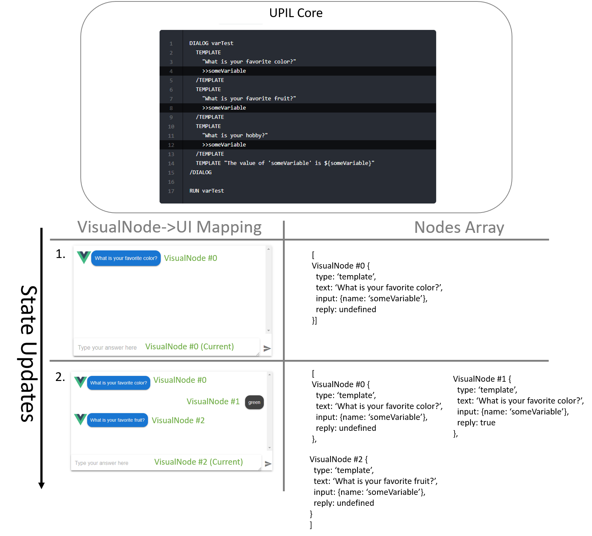
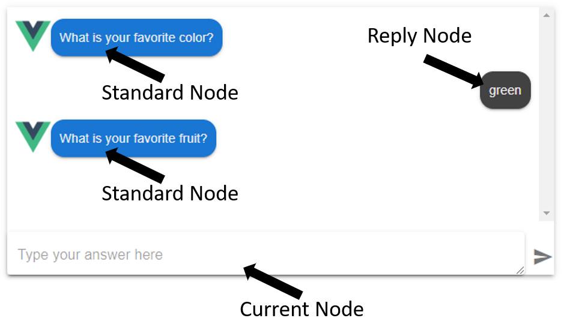

# Vue Application development

Generally, a developer working in an application framework such as Vue or React will setup an instance of `UPILCore`, and then pass that instance to a component which will translate an array of `VisualNode` `nodes[]` into visual elements, and handle user input.
<br/><br/>

There are two different modes that a `UPILCore` can use to interpret a UPIL script. A chatbot-mode and a form-mode. 
You can use the same script for both, utilizing the chatbot-mode to gather data initially, and then a form-mode to allow for displaying gathered data and editing saved values. The mode can be set as an option when
starting a `UPILCore` instance.

## Widgets

Widgets are used to visualize `nodes[]` objects generated by a `UPILCore` instance. 

## `UPILCore` 

In order to consume UPIL scripts in your Javascript application, an instance of `UPILCore` is used. `UPILCore` contains the UPIL script parser, and the UPIL interpreter. In general, 
a developer will create a `UPILCore` instance and setup runtime hooks, and then pass it to a component which will handle the rest.


## The `UPILCore` API
<br/><br/>
The API provides the following capabilities for communications to/from UPIL:


* A method to load a UPIL script as a string and start the interpreter.
* An array of `nodes[]` that can be represented as text or user input in your application.
* A `consume` method used to send user input back to the UPIL engine.
* Lifecycle and event listeners to run custom code in various situations such as:
  * Scenario start
  * Scenario end
  * User input
  * Preload state key-values
* Alternative modes:
  * The default bot-mode that waits for user input before exposing subsequent nodes in the `nodes[]` array.
  * A form-mode which continues as far as possible in the script given that the variables required for interpretation already exist.
* The ability to get the current key-value pairs representing the state of the instance.
* The ability to subscribe to state or event updates. 
<br/><br/>

As your application interacts with the UPIL engine via the `consume` method, the `UPILCore` instance will update `nodes[]` appropriately based on the instructions in the UPIL script.

User-input can either be handled with the appropriate hook as variables are updated in `UPILCore`, or the application can query `UPILCore` for all variables' current state at any time.

Finally, state can be pre-loaded into a `UPILCore` instance to influence the UPIL script's behavior, or to pre-populate values for text substitution or form-mode.

### Instantiation 
Use the following pattern to instantiate a new `UPILCore` instance:
```javascript
import { UPILCore } from '@appsocially/vue-upil-plugin'
const upilInstance = new UPILCore()
```
Generally, the provided Vue.js components require the developer to instantiate their own `UPILCore` instance and pass it as a prop to the component.

### Starting a scenario

Once our listeners and hooks are setup, we can pass in a scenario and start our `upilInstance` using the `startRaw` method.
The method takes two parameters, a string containing a UPIL script, and an optional settings object.
<br/><br/>

Example with default chatbot-mode:

```javascript
upil.startRaw(scenarioString)
```
Example with form-mode activated in the settings object:

```javascript
upil.startRaw(scenarioString, {
  mode: 'form',
  resetOnInputUpdate: true
})
```

### UPIL State
It is common to need access to the state being tracked by a UPIL instance. To retrieve the state, use:
```javascript
const {input, nodes} = upilInstance.UpilStore.getState()
```

* `input` - An object containing the state of variables and their values as key-value pairs
* `nodes[]` - An array of `VisualNode`. These are stored in the array in the order that they have been interpreted in the script. Each node is meant to convey information to a user. 
The Vue.js components use this array to build the UI.

::: tip
Why do we say that the `nodes[]` are composed of `VisualNode`? There are other non-visual nodes used by UPIL such as actions, dialogs, groups, and boolean expressions. These exist in the event stream, but are filtered for your convenience so that it is easy to focus on mapping a UPIL script to a UI.
:::

As a user interacts with UPIL, the interpreter will continue to save state, and update its `nodes[]`. In order to be notified of these changes, use the `upilInstance.UpilStore.subscribe` method, and pass in a function that you
want to be called each time the state changes.

```javascript
upilInstance.UpilStore.subscribe(() => {
  const {input, nodes} = upilInstance.UpilStore.getState()
  // ...do something with the state
})
```

### Lifecycle hooks and event listeners

Developers can register a hook using the `upilInstance.on(event, handler)` method. The `event` is a string which identifies which event to subscribe to, the `handler` is a function. The following events can be subscribed to:
<br/><br/>

* `preload-input` - Expects a handler which returns an object containing key-values to preload the state of the `upilInstance`
* `scenario-start` - Runs at the beginning of a scenario. Ignores the handler's return object.
* `scenario-end` - Runs at the end of a scenario. Ignores the handler's return object.
* `scenario-end` - Runs at the end of a scenario.
* `input-update` - Runs whenever the `consume` function of a `upilInstance` is called.
* `external` - Runs when `EXTERNAL` nodes are found in a scenario. `EXTERNAL` nodes are used to request data be loaded into pre-defined variables before a scenario starts. 

The `handler` functions receive two arguments:

```javascript
(payload, preventDefault)=>{...}
```
The `payload` contains a `context` property, which lets you get the current state of the `upilInstance`, and an `event` property, which allows you to get the event type, and the node that triggered the event. A breakdown of the
`payload` argument:

```javascript
const { context: { store }, event: { node: { text, type, input: { name }, label } } } = payload
const { mode } = payload.context.settings() // Whether botmode or formmode
const state = store.getState()
const { input } = state // Object containing key-value pairs for variables in the upilInstance
const inputValue = input[name] // In an `input-update` event, get the user-input that triggered the event 
```

## ChatThemePlugin Component
The ChatThemePlugin is a component that maps a scenario to a standard-looking chat application UI, where a user will be chatting with a 'bot' which is being driven by a UPIL scenario. 
<br/><br/>

<Figure caption="Visualization of how a scenario is mapped to a Chat UI. In this case, user input triggers the UPIL Core to update its state.">
 
</Figure>

Basic example of `ChatThemePlugin` component usage:

```javascript
// Vue sfc component
<template>
  <ChatThemePlugin
    v-if="ready"
    :listeners="listeners"
    :override="override"
    :overrideCurrent="overrideCurrent"
    :upil="upil"
    :avatar="Logo"
  />
</template>


<script>
import { ChatTheme } from '@appsocially/vue-upil-plugin'
const { ChatThemePlugin } = ChatTheme
import Logo from './logo.png'

export default {
  components: {
    ChatThemePlugin
    // rest of components....
  },
  data(){
    return {
      Logo,
      // ...
    }
  },
  // ...
}
</script>
```

### Listeners prop

The listeners prop expects an object whose keys are event names, and values are handler functions.

### Mapping widgets to nodes: `override` and `overrideCurrent`

<Figure caption="The 'current' node is overridden seperately, to support a different style at the bottom of the chat UI">
 
</Figure>

Each entity in a UPIL scenario is represented by a `VisualNode` with various properties associated with it. These properties include:
<br/><br/>

* The entity type: `TEMPLATE`, `SELECT`, `MULTI_SELECT`
* The text associated with the entity
* Entity input metadata if the entity expects user input. This metadata includes the variable name, variable type, and a list of options in the case of a select-based entity.
* The label assigned to an entity
* Whether the node is a reply-node or not
<br/><br/>

By default, all nodes are represented as widgets based on their entity-type. Using the override props, nodes can be freely overridden based on any of the available node-properties. In general, when creating a custom widget for chat-mode, there are three node-types to consider (Standard, Reply, and Current):
<br/><br/>

### Override function signature

```js
function (_, node, component) {...}
```

The `node` argument is the `VisualNode`-representation of the entity that the UPIL engine is asking to map to a widget. The `component` argument is the default component. 
<br/><br/>

An example override function:

```js
export function override (_, node, component) {
  switch (node.label || '') {
    case 'interviewTime':
      return () => import('./timeReply')
    default:
      return component
  }
}
```

The above override function returns the `timeReply` component to use as the widget for any nodes labeled `interviewTime`, otherwise it returns the default component `component`.


### Difference between 